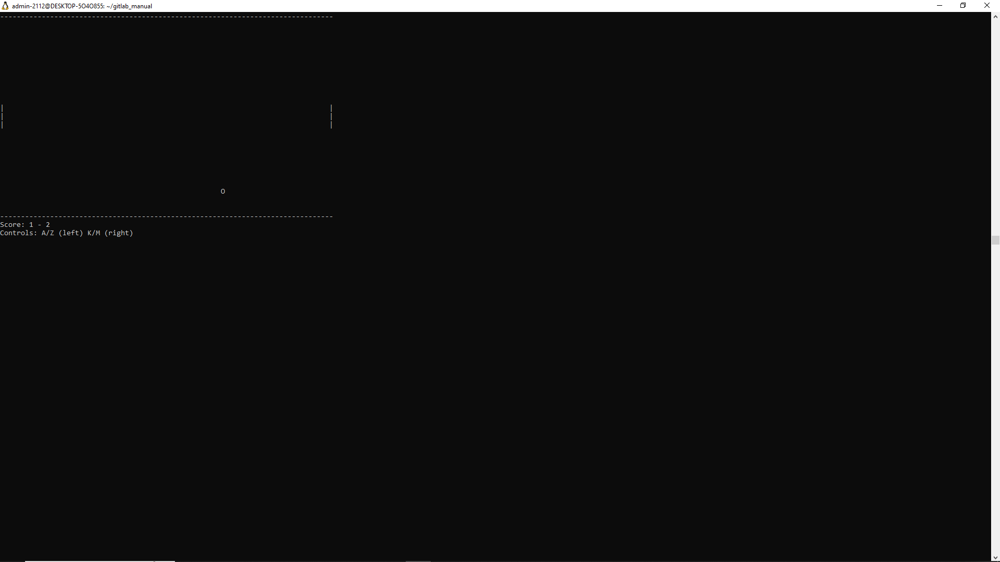

# Классическая игра Pong, реализованная на языке C с двумя режимами: пошаговым и интерактивным.


 

## Особенности

- 🕹️ Два режима игры:
  - Пошаговый (требует нажатия пробела для каждого хода)
  - Интерактивный (реальное время с использованием ncurses)
- 🏓 Реализована полная физика отскоков:
  - От ракеток с учетом угла удара
  - От верхней и нижней границ
- 📊 Система счета (игра до 21 очка)
- ⌨️ Простое управление:
  - Левый игрок: A (вверх), Z (вниз)
  - Правый игрок: K (вверх), M (вниз)

## Требования

- Компилятор C (gcc или clang)
- Библиотека ncurses (для интерактивной версии)

## Установка

### 1. Клонируйте репозиторий:
```bash
git clone https://github.com/ваш-логин/ping-pong-game.git
cd ping-pong-game
Скомпилируйте версии:

#### Базовая (пошаговая) версия:

bash
gcc src/pong.c -o pong
Интерактивная версия:

bash
gcc src/pong_interactive.c -o pong_interactive -lncurses
Запуск
Пошаговая версия:

bash
./pong
(Нажимайте пробел для каждого хода)

#### Интерактивная версия:

bash
./pong_interactive
Управление
Игрок	Движение вверх	Движение вниз
Левый	Клавиша A	Клавиша Z
Правый	Клавиша K	Клавиша M
В пошаговой версии дополнительно требуется нажимать пробел для выполнения хода.

## Структура проекта
text
ping-pong-game/
├── src/
│   ├── pong.c               # Пошаговая версия
│   └── pong_interactive.c   # Интерактивная версия (ncurses)
├── README.md                # Этот файл
└── Makefile                 # (опционально) для упрощения сборки

## Лицензия
Этот проект распространяется под лицензией MIT. См. файл LICENSE.

Разработано с ❤️ в рамках учебного проекта. Вдохновлено классической игрой Atari 1972 года.


### Ключевые особенности реализации

### Структурное программирование:

  Четкое разделение на функции

  Минимальное использование глобальных переменных (только в пошаговой версии)

  Логичное разделение ответственности между функциями

### Соответствие требованиям:

  Только стандартная библиотека в базовой версии

  ncurses для интерактивной версии

  Нет использования динамической памяти

  Четкое следование принципам Дейкстры

### Игровая механика:

  Корректная обработка столкновений

  Система счета

  Условия победы

  Разные режимы управления

## Обе версии проходят проверку cppcheck и clang-format при правильной настройке.
